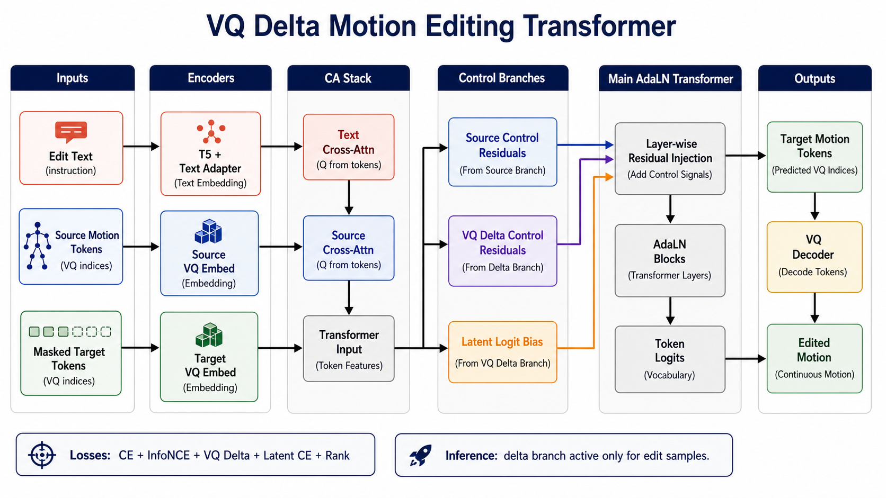

# VQ Delta Control Experiment

Date: 2026-07-07

Base:

```text
vq-latent branch / claude rewind backbone
```

Status:

```text
new experiment, not validated yet
```

Architecture figure:



## Goal

The current source branch can provide useful source-motion guidance, but edit text is still too weak. Earlier text branch, condition enhance, edit-map, and semantic latent residual experiments did not break the edit R@1 ceiling.

This experiment keeps the stable source-branch backbone and adds a direct VQ-latent delta control path:

```text
source VQ latent + text/source hidden -> predicted target-source latent delta
```

The key change is that text is no longer only an AdaLN condition or auxiliary ranking signal. It gets a small direct path into:

```text
1. layer-wise AdaLN residual injection
2. final token logits through VQ codebook similarity
```

## Backbone Kept

The claude rewind main path is preserved:

```text
masked target tokens
    -> text_cross(masked target, text tokens)
    -> source_cross(text_cross, source tokens)
    -> transformer_input = masked target tokens + source_cross
    -> source control branch(aligned source)
    -> main AdaLN transformer
    -> raw token logits
```

Generation samples still have no source branch effect.

## New VQ Delta Branch

The added path is active only for editing samples with real source and real text.

```text
aligned source ids
    -> VQ codebook lookup
    -> z_src
    -> delta_code_proj

transformer_input + text_cross + source_cross + projected z_src
    -> delta_control_proj
    -> delta_encoder(ControlNet-style AdaLN copy)
    -> delta residuals
    -> delta_head
    -> pred_delta_z
```

Predicted target latent:

```text
pred_z = z_src + pred_delta_z
```

The branch injects two signals:

```text
main AdaLN hidden += delta_beta * delta_residuals
final_logits += delta_alpha * latent_residual_logits
```

where:

```text
latent_residual_logits =
    cosine(pred_z, VQ codebook) / temp
  - cosine(z_src, VQ codebook) / temp
```

The subtraction is intentional. If the delta branch predicts no edit, its logit bias is close to zero, so it should not simply copy source tokens.

## Loss

Main loss remains token CE:

```text
CE(final_logits, target_ids)
```

Extra edit-only losses:

```text
vq_delta:
    SmoothL1(pred_delta_z, z_tgt - z_src)

vq_latent:
    CE(cosine(pred_z, VQ codebook), target_ids)

vq_rank:
    max(0, margin + dist(pred_z, z_tgt) - dist(pred_z, z_src))
```

Loss weights in the current yaml:

```yaml
weight_transformer_loss: 1.0
weight_motion_text_InfoNCE: 0.2
weight_delta: 0.5
weight_latent: 0.05
weight_rank: 0.05
```

Model knobs:

```yaml
use_vq_delta: True
delta_alpha: 0.2
delta_beta: 0.3
delta_temp: 0.15
```

## Why This Differs From The Failed Semantic Residual

Previous failed version:

```text
VQ latent -> latent_MLP -> learned semantic space
semantic_codebook = latent_MLP(codebook)
```

Problem:

```text
It created another latent space and asked it to become semantic,
but the signal did not reliably transfer to token prediction.
```

Current version:

```text
stay in original VQ codebook latent space
predict z_tgt - z_src directly
convert pred_z back to token logits by codebook similarity
```

So the auxiliary path is closer to the decoder/token decision space.

## Expected Signals

If this works, early training should show:

```text
vq_delta decreases steadily
vq_latent decreases but should not dominate CE
correct text logp improves more than shuffled text
edit R@1 improves beyond the old 0.38-0.41 range
generation R@1 should not collapse
```

Risk signs:

```text
gen R@1 drops strongly
edit R@1 still stops around 0.35-0.40
vq_latent falls but retrieval does not move
TMR-FID improves while G2T stays flat
```

## Interpretation Plan

If it improves only early speed but not the ceiling:

```text
VQ latent delta gives optimization help, but still does not solve instruction grounding.
```

If it hurts generation:

```text
delta path or latent CE is leaking into non-edit behavior, reduce delta_alpha / weight_latent,
or hard-disable the branch for generation in every eval path.
```

If edit improves without gen regression:

```text
next test should tune delta_alpha and weight_delta,
then check whether source inpainting is still needed.
```

## Result Update

Epoch:

```text
119
```

Validation:

```text
loss: 6.450
vq_delta: 0.028
vq_latent: 6.317
vq_rank: 0.286
accuracy: 0.160
```

Generation:

```text
R@1/2/3: 0.5006 / 0.6939 / 0.7902
Matching: 3.0645
FID: 0.3307
Diversity: 9.4052
```

Motion editing:

```text
G2T R@1/2/3: 0.4125 / 0.5984 / 0.7063
G2T AvgR: 3.77
G2S R@1/2/3: 0.4234 / 0.5984 / 0.7078
G2S AvgR: 3.68
TMR-FID: 0.1357
TMR-Diversity: 1.3304
```

Global monitor:

```text
G2T R@1/2/3: 0.1500 / 0.2333 / 0.3182
G2T AvgR: 36.94
G2S R@1/2/3: 0.1394 / 0.2061 / 0.3045
G2S AvgR: 37.37
```

Peak note:

```text
best observed edit R@1 around 0.434, slightly higher than old 0.425 peak,
but likely within fluctuation rather than a reliable breakthrough.
```

Visual check:

```text
some samples are better and partially follow the edit,
but motion is still often incomplete or too small in amplitude.
```

Conclusion:

```text
failed as a breakthrough experiment.
VQ latent + logit bias is useful enough to keep as a reference,
but it does not solve instruction grounding by itself.
```

## Keep / Drop

Worth keeping:

```text
1. Direct VQ codebook latent access.
2. Edit-only activation; no generation leakage.
3. Residual logit bias instead of full latent-logit replacement.
4. Low-weight rank/latent monitoring as diagnostics.
```

Not worth keeping as the main solution:

```text
1. Heavy extra delta branch if it only gives noise-level R@1 gain.
2. Treating VQ latent delta alone as sufficient text grounding.
3. Expecting final logit bias to fix incomplete motion amplitude.
```

Next likely direction:

```text
keep source branch stable,
but look for a stronger text instruction learning path that affects motion amplitude/content,
not only token-neighbor preference in VQ latent space.
```

## Review Notes: Why The Gain Was Small

This design is not only a final-logit trick. It has two control paths:

```text
1. layer-wise delta residuals:
   delta_encoder -> delta_residuals -> main AdaLN blocks

2. final VQ latent residual logits:
   final_logits = raw_logits + delta_alpha * latent_residual_logits
```

So the weak gain should not be explained as "late fusion only". The more likely issue is control responsibility:

```text
delta input = transformer_input + text_cross + source_cross + z_src
```

`transformer_input` and `source_cross` are already source-dominant. The branch can therefore learn a safe correction around source motion instead of a clean text-driven edit direction.

Another issue is the VQ latent target:

```text
z_tgt - z_src
```

This is a reconstruction/codebook displacement, not guaranteed to be a semantic edit vector. It may include pose mismatch, timing shift, quantization noise, and alignment error. As a result, the branch can move tokens closer to target without producing a complete kinematic edit.

## Optimization Ideas To Keep

Make the delta signal cleaner before increasing its strength:

```text
source branch:
  motion prior / source structure

delta branch:
  edit text -> source-to-target residual
```

Recommended cleanup:

```text
1. Reduce dependency on source_cross inside delta control.
2. Keep z_src and current motion/canvas state.
3. Use purer edit-text feature as the main condition.
4. Keep generation samples fully gated out.
```

Weight tuning should come after signal cleanup. Current values are conservative:

```yaml
delta_beta: 0.3
delta_alpha: 0.2
```

Possible schedule if the delta branch is stable:

```text
early:
  delta_beta 0.1 - 0.3
  delta_alpha 0.1 - 0.2

later:
  delta_beta 0.5 - 0.8
  delta_alpha 0.3 - 0.5
```

Do not simply enlarge these weights before the branch learns a reliable text-driven residual. Otherwise it may only amplify source-dominant weak corrections.
